# What is Typescript?

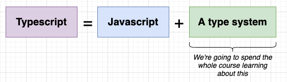

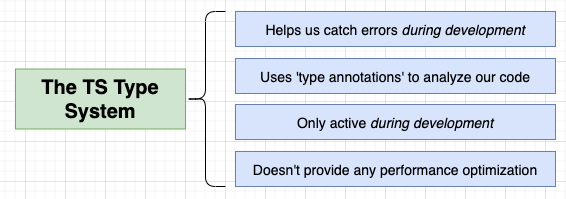

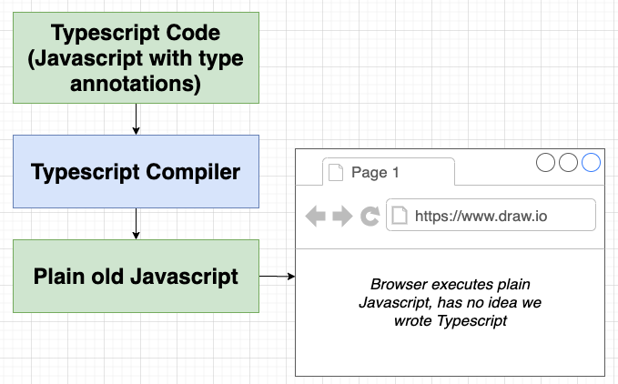

## To work with NodeJS engine

Install Typescript compliler: `npm i -g typescript ts-node`

`ts-node index.ts` combines these two commands `tsc index.ts` and `node index.js` (`tsc` is typescript compiler)

- ### Build process (Compilation)

  `tsc index.ts`: By default, tsc will build a `index.js` and put it at the root directory. To change the directory, we need to change it in a Typescript config file

  `tsc --init`: create a `tsconfig.json` file for the project.

  In `tsconfig.json`:

  - Change the directory for the output file of compiling index.ts to index.js: `"outDir": "./build"`
  - Change the root (working) directory by: `"rootDir": "./src"`

  In the terminal, at the main project folder directory (ex: 4-sort, not src folder or the build folder):

  - To compile index.js file, we only need to type `tsc` in the command line
  - To not having to run `tsc` manually everytime we make any changes in the root directory, we can run `tsc -w` for it to keep watching for saved changes the root directory and recompile automatically.

- ### Execution

  `node build/index.js`

- ### Concurrent Compilation and Execution

  - Use npm as project manager `npm init`
  - Install 2 npm packages: `nodemon` and `concurrently`
  - Write scripts in package.json:

    ```json
    "scripts": {
      "start:build": "tsc -w",
      "start:run": "nodemon build/index.js",
      "start": "concurrently npm:start:*"
    }
    ```

  - In terminal, main project foler, run `npm start`

## To work in the browser

`npm i -g parcel-bundler` tool to help run Typescript in the browser

`parcel index.html` parcel will look at the script tag inside index.html, see the index.ts, it'll convert it into JS and change the script src to the JS file

# Reusable Code in TS

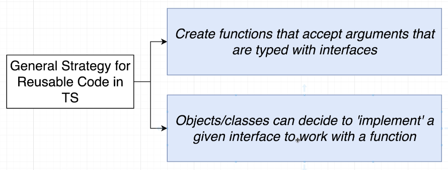

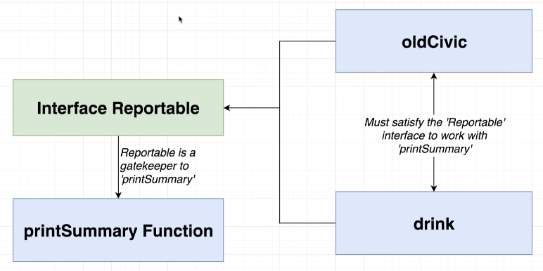

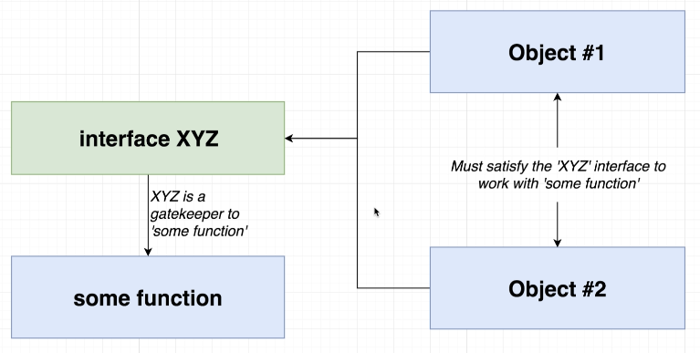

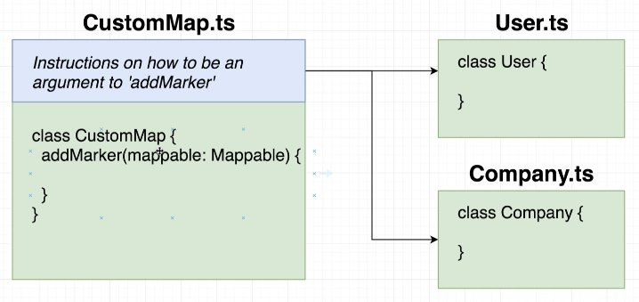

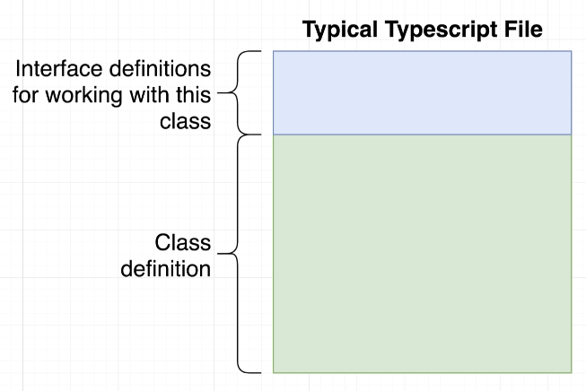

# FEATURES & SYNTAX

## TYPES

- ### Definition & Overview

  Easy way to refer to the different properties and functions that a value has

  A value in JS and TS is anything we can assign to a variable: String, Number, Boolean, null, undefine, object, function, class, array, etc. All of those different things have types.

  - `"red"` in short, we'd say this is a String. What we really means is: it is a value that has all the properties and methods that a String has.
  - `Todo` interface we defined in `fetchjson` project is also a Type

  There are 2 Type categories:

  - **Primitive Types**: number, string, boolean, symbol, void, null, undefine
  - **Object Types**: functions, classes, arrays, objects, and any Types we create

- ### Why do we care?

  Types are used by the Typescript Compliler to analyze our code for errors

  Types allow other engineers to understand what values are flowing around our codebase

- ### Examples

  ```ts
  // today has a Date type and all methods that a Date type has
  const today = new Date();
  today.getMinutes();

  // person has a type of an object with a property age
  const person = {
    age: 20,
  };

  // red has a type of class Color with no property or method
  class Color {}
  const red = new Color();
  ```

- ### When to use this?

  Everywhere

## TYPE ANNOTATIONS

- ### Definition + Overview

  Code we add to tell Typescript what type of value a variable will refer to

  We do this because we want to make sure Typescript awares of all variable Types we're working with

  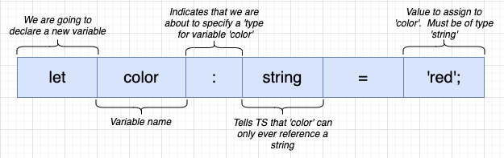

- ### Examples

  ```ts
  // we indicate variable apples has a type of number. If we assign anything other than number to apples, TS will give us an error.
  // Whatever after colon : and before = is called Type Annotation.
  // In this case it is number, string[], { x: number; y: number }, (i: number) => void
  let apples: number = 5;
  let colors: string[] = ['red', 'green', 'blue'];

  class Car {}
  let car: Car = new Car();

  // in the object type annotation, the field names has also match exactly
  let point: { x: number; y: number } = {
    x: 10,
    y: 20,
  };

  // Function: Parameter name has to match exactly
  const logNumber: (i: number) => void = (i: number) => {
    console.log(i);
  };
  ```

- ### When to use this?

  - When we declare a variable on one line then initialize it later
  - When we want a variable to have a type that can't be inferred
  - When a function returns the 'any' type and we need to clarify the value

- ### Annotations Around Functions

  **Def**: Code we add to tell Typescript what type of arguments a function will receive and what type of values it will return

  ```ts
  const add = (a: number, b: number): number => a + b;

  const todayWeather = {
    date: new Date(),
    weather: 'sunny',
  };

  const logWeather = ({
    date,
    weather,
  }: {
    date: Date;
    weather: string;
  }): void => {
    console.log(date, weather);
  };

  logWeather(todayWeather);
  ```

- ### Annotations Around Objects

  Example of how to destructure fields in objects

  ```ts
  const profile = {
    name: 'alex',
    age: 20,
    coords: {
      lat: 0,
      lng: 15,
    },
    setAge(age: number): void {
      this.age = age;
    },
  };

  const { age, name }: { age: number; name: string } = profile;
  const {
    coords: { lat, lng },
  }: { coords: { lat: number; lng: number } } = profile;
  ```

## TYPE INFERENCE

- ### Definition + Overview

  Typescript tries to figure out what type of value a variable refers to

  **Value has to be initialized on the same line**

  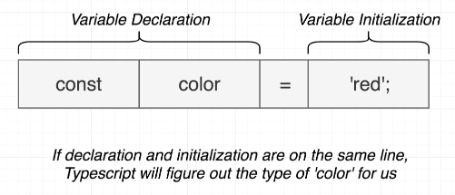

  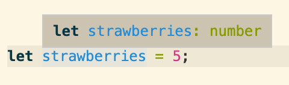

- ### When to use this?

  Always, whenever we can, we will rely on Type inference

- ### Inference Around Functions

  **Def**: Typescript tries to figure out what type of value a function will return (only works for the RETURNed value)

  Even though Typescript can infer the returned value of a function, we never want to use it because sometimes we might make a mistake in our return statement and typescript won't be able to tell us.

## `any` TYPE

- ### Definition + Overview

  `any` is a type, just as 'string' or 'boolean' are. It means TS has no idea what this is because it cannot check for correct property references.

  We need to avoid variables with 'any' at all costs, otherwise Typescript cannot error checking for us.

- ### Examples

  ```ts
  // 1) function that returns 'any' type
  const json = '{"x": 10, "y": 20}';
  const coordinates = JSON.parse(json); // Typescript cannot predict what will be return from JSON.parse because JSON.parse returns different value types depending on what we pass into it. So Typescript decides to give it an 'any' type

  // 2) Declare a variable on one line and initalize it later
  let words = ['red', 'green', 'blue'];
  let foundWord; // 'any' type

  for (let i = 0; i < words.length; i++)
    if (words[i] === 'green') foundWord = true;

  // 3) When we want a variable whose type cannot be inferred correctly
  let numbers = [-10, -1, 12];
  let numberAboveZero = false; // Typescript marks numberAboveZero as a Boolean

  for (let i = 0; i < numbers.length; i++)
    if (numbers[i] > 0) numberAboveZero = numbers[i]; // Typescript says this is an error because we try to assign a number to a boolean variable
  ```

- ### How to fix it?

  We add Type Annotation to the variable

  ```ts
  const coordinates: { x: number; y: number } = JSON.parse(json);

  let foundWord: boolean; // or let foundWord = false;

  let numberAboveZero: boolean | number = false;
  ```

## ARRAY TYPE

- ### Definition

  Arrays where each element is some consistent type of value

- ### Example

  ```ts
  const carMakers = ['ford', 'toyota', 'chevy'];
  const dates: Date[] = [];
  dates = [new Date(), new Date()];
  ```

- ### Why Typed Arrays?

  - TS can do type inference when extracting values from an array
  - TS can prevent us from adding incompatible values to the array
  - We can get help with 'map', 'forEach', 'reduce' functions
  - Flexible - arrays can still contain multiple different types

  ```ts
  // Help with inference when extracting values
  const car = carMakers[0]; // TS marks car as a string

  // Prevent incompatible values
  carMakers.push(100); // TS will tell us that we can't insert a number into a string array

  // Help with 'map'
  carMakers.map((car: string): string => car.toUpperCase()); // TS shows all methods belong to string when we type 'car.'

  // Flexible types
  const importantDates: (Date | string)[] = [new Date()];
  importantDates.push('2030-10-12');
  importantDates.push(new Date());
  importantDates.push(10); // not allowed
  ```

- ### When to use typed Array?

  Any time we need to represent a collection of records with some arbitrary sort order

## TUPLES TYPE

- ### Definition

  Array-like structure where each element represents some property of a record

- ### Example

  ```ts
  const pepsi: [string, Boolean, number] = ['brown', true, 40];
  pepsi[0] = 40; // 40 is not assignable to type string

  type Drink = [string, boolean, number]; // Type alias
  const sprite: Drink = ['clear', true, 50];
  const tea: Drink = ['black', false, 0];
  ```

## TYPE GUARDS

When a type annotation is a union of 2 different types like

```ts
collection: number[] | string
```

`collection` now only has access to common methods that both an array of numbers and a string have. (side note: TS is very smart, for method like accessing and editing an element by index, it knows string is immutable so collection now can only read an element by index but not editing it by index).

To restore all methods of `number[]` or `string` on collection, we use type guards by:

```ts
if (collection instanceof Array) { collection will have all methods that an array has }
if (typeof collection === 'string') {collection will have all methods that a string has}
```

- `typeof`: (Narrow type of a value to a primitive type) works for `number`, `string`, `boolean`, `symbol`
- `instanceof`: (Narrow down every other type of value) Every other value that is created with a constructor function

## INTERFACE

- ### Definition

  Creates a new type, describing the property names and value types of an object

- ### Example:

  ```ts
  interface Vehicle {
    name: string;
    year: Date;
    summary(): string;
  }

  interface Reportable {
    summary(): string;
  }

  const printVehicle = (vehicle: Vehicle): void => {
    console.log(`Name: ${vehicle.name}. Year: ${vehicle.year}.`);
  };

  const printReport = (item: Reportable): void => {
    console.log(item.summary());
  };

  const oldCivic = {
    name: 'civic',
    year: new Date(),
    summary(): string {
      return `Name: ${this.name}`;
    },
  };

  const cola = {
    color: 'brown',
    carbonated: true,
    summary(): string {
      return `My drink has ${this.sugar}`;
    },
  };

  printVehicle(oldCivic);
  // we can't call printVehicle(cola) b/c cola doesn't match the interface Vehicle

  // we can use both oldCivic and cola with printReport because they both have function summary() to match interface Reportable
  printReport(oldCivic);
  printReport(cola);
  ```

## CLASSES

- ### Definition

  Blueprint to create an object with some fields (values) and methods (functions) to represent a 'thing'

- ### Inheritance

  ```ts
  class Vehicle {
    drive(): void {
      console.log('chugga chugga');
    }

    honk(): void {
      console.log('beep');
    }
  }

  class Car extends Vehicle {
    // overriding drive method
    drive(): void {
      console.log('vroom');
    }
  }

  const car = new Car();
  car.drive(); // vroom
  car.honk(); // beep
  ```

- ### Modifiers

  `public`: (default) This method/field can be called anywhere anytime

  `private`: This method/field can only be called by other methods in this class. (We don't want other developers call this method because maybe they'll break something)

  `protected`: This method/field can be called by other methods in this class, or by other methods in child classes

  ```ts
  class Vehicle {
    protected honk(): void {
      console.log('beep');
    }
  }

  class Car extends Vehicle {
    private drive(): void {
      console.log('vroom');
    }

    startDrivingProcess(): void {
      this.drive();
      this.honk();
    }
  }

  const car = new Car();
  // can't call cars.drive() because drive() is marked private, it can only be called within the class
  // can't call cars.honk() because it's a protected method. It's only available within the parent class and its children. But not available to any intances.
  car.startDrivingProcess();
  ```

- ### Fields

  ```ts
  class Vehicle {
    constructor(public color: string) {}
  }

  class Car extends Vehicle {
    constructor(public wheels: number, color: string) {
      super(color);
    }
  }

  const vehicle = new Vehicle('orange');
  console.log(vehicle.color);

  const car = new Car(4, 'red');
  ```

## INTERFACES VS INHERITANCE (Abstract Classes)

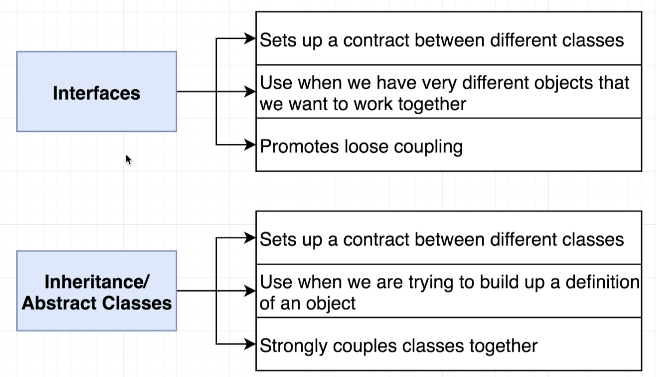

## ENUMS - enumeration (TYPE)

**Why do we use `enum` over a normal JS object?** The main purpose of an enum is to signal other engineers that this is a collection of very closely related values.

We can also use enum as a type.

**When to use it?** Use whenever we have a small fixed set of values that are all closely realted and known at compile time

```ts
// A small fixed set of possible outcome of a football match
enum MatchResult {
  HomeWin = 'H',
  AwayWin = 'A',
  Draw = 'D',
}

console.log(MatchResult.HomeWin);
```

## GENERICS

- Like function arguments, but for types in class/function definitions
- Allows us to define the type of a property/argument/return value at a future point
- Used heavily when writing reusable code

```ts
class holdAnything<T> {
  data: T;
}

const holdNumber = new holdAnything<number>();
holdNumber.data = 123;

const holdString = new holdAnything<string>();
holdString.data = 'something';
```

## COMPOSITION

- Delegation is one way of making composition very powerful.

- Instead of making class Window a subclass of Rectangle, the Window class might reuse the behavior of Rectangle by keeping a Rectangle instance variable and delegating Rectangle-specific behavior into it. In other words, instead of a Window being a Rectangle, it would HAVE a Rectangle. Window must now forward requests to its Rectangle instance explicitly, whereas before, it would have inherited those operations.

  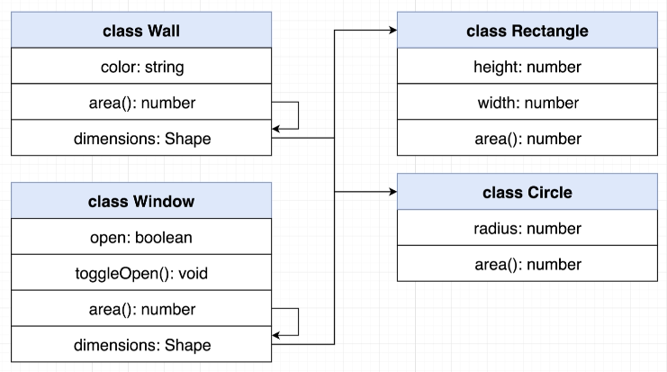
